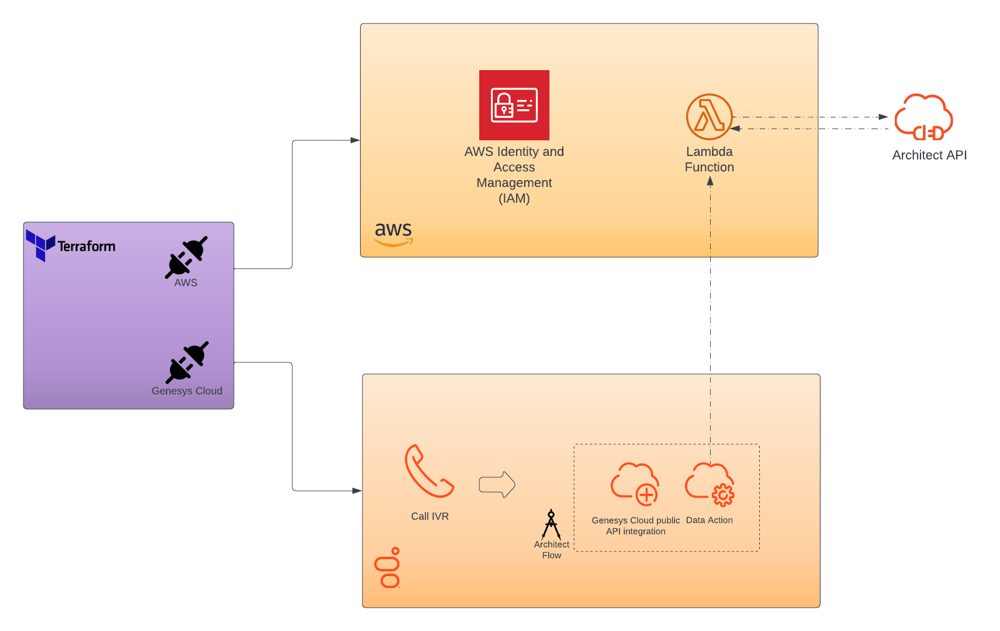

# Enable an emergency group by calling an AWS Lambda via a Genesys Cloud Data Action (DRAFT)

> View the full [Enable an emergency group by calling an AWS Lambda via a Genesys Cloud Data Action](https://developer.mypurecloud.com/blueprints/) article on the Genesys Cloud Developer Center. 

This Genesys Cloud Developer blueprint demonstrates how to trigger an AWS Lambda function from a Genesys Cloud data action in order to properly enable an emergency group.

