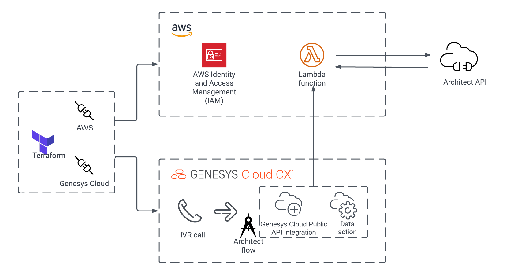

This Genesys Cloud Developer blueprint demonstrates how to trigger an AWS Lambda function from a Genesys Cloud data action to enable an emergency group.

This blueprint demonstrates how to:

* Build an AWS Lambda function to interact with the Genesys Cloud Public API.
* Build the necessary AWS IAM Roles to allow for a data action to interact with the AWS Lambda function.
* Build a Genesys Cloud data action and integration, configured with the correct Amazon Resource Names (ARNs).
* Deploy the required infrastructure using Terraform and CX as Code.

## Scenario

You want to trigger a data action from your Architect flow that enables or disables an emergency group by ID. However, the Architect API provides only a PUT method, and that method overwrites the emergency group and disconnects all of its associated IVRs unless their GUIDs are provided in the request body. The workaround is to perform a GET operation on the emergency group, change the value of `enabled` in the response object, and use that JSON data as your request body in the PUT operation. These operations cannot be easily accomplished within an Architect flow.

## Solution

* Create an AWS Lambda function that uses the Genesys Cloud Go SDK to perform the GET and PUT operations. 
* Create the necessary IAM roles and policies.
* Create a Genesys Cloud Lambda integration and data action to trigger the AWS Lambda function.  

## Solution components

* **Genesys Cloud** - A suite of Genesys Cloud services for enterprise-grade communications, collaboration, and contact center management. In this solution, you use a Genesys Cloud integration and data action.
* **CX as Code** - A Genesys Cloud Terraform provider that provides a command-line interface for declaring core Genesys Cloud objects.
* **AWS Terraform Provider** - An Amazon supported Terraform provider that has an interface for declaring Amazon Web Services infrastructure.
* **AWS Lambda** - A serverless computing service for running code without creating or maintaining the underlying infrastructure. For more information, see [AWS Lambda](https://aws.amazon.com/lambda/ "Opens the Amazon AWS Lambda page") in the Amazon featured services website. 



## Software development kits

The project contains the necessary packages required to deploy the solution described in the blueprint, including a precompiled version of the AWS Lambda function.

You can change the AWS Lambda function in the `lambda-code` directory. To rebuild the Lambda function:
1. Install the Go SDK. You can install the latest Go version from [here](https://go.dev/ "Goes to the Go site").
2. Change to the  `blueprint/lambda-code` directory.
3. Execute the following command:
   ```
   GOOS=linux go build -o bin/main ./...
   ```

A Linux executable file named `main` is built in the `/bin` directory. The CX as Code tool compresses the `main` file and deploys the zip file as part of the AWS Lambda deploy via Terraform.

:::primary

**NOTE**: The Linux executable `main` runs only on Linux. Go allows you to build Linux executables on Windows and OS/X, but you cannot run them locally.
:::

## Prerequisites

### Specialized knowledge

* Administrator-level knowledge of Genesys Cloud
* AWS Cloud Practitioner-level knowledge of AWS IAM and AWS Lambda
* Experience with Terraform

### Genesys Cloud account

* A Genesys Cloud license. For more information, see [Genesys Cloud Pricing](https://www.genesys.com/pricing "Opens the Genesys Cloud pricing page") in the Genesys website.
* Master Admin role. For more information, see [Roles and permissions overview](https://help.mypurecloud.com/?p=24360 "Opens the Roles and permissions overview article") in the Genesys Cloud Resource Center.
* CX as Code. For more information, see [CX as Code](https://developer.genesys.cloud/api/rest/CX-as-Code/ "Opens the CX as Code page").

### AWS account

* An administrator account with permissions to access the following services:
  * AWS Identity and Access Management (IAM)
  * AWS Lambda
* AWS credentials. For more information about setting up your AWS credentials on your local machine, see [About credential providers](https://docs.aws.amazon.com/sdkref/latest/guide/creds-config-files.html "Opens the About credential providers page") in the AWS documentation.

### Development tools running in your local environment

* Terraform (the latest binary). For more information, see [Download Terraform](https://www.terraform.io/downloads.html "Opens the Download Terraform page") in the Terraform website.
* Go 1.16 or higher. For more information, see [Download Go](https://go.dev/ "Opens the Go website").

### Clone the GitHub repository

Clone the GitHub repository [set-emergency-group-lambda-blueprint](https://github.com/GenesysCloudBlueprints/set-emergency-group-lambda-blueprint "Opens the GitHub repository") to your local machine. The `set-emergency-group-lambda-blueprint/blueprint` folder includes solution-specific scripts and files in the following subfolders:
* `lambda-code` - Source code for the AWS Lambda function
* `terraform` - All Terraform files to deploy the application

### Set up your AWS and Genesys Cloud credentials

To run this project using the AWS and Genesys Cloud Terraform provider, open a Terminal window, set the following environment variables and run Terraform:

 * `GENESYSCLOUD_OAUTHCLIENT_ID` - The Genesys Cloud OAuth client credential under which the CX as Code provider runs.
 * `GENESYSCLOUD_OAUTHCLIENT_SECRET` - The Genesys Cloud OAuth client secret under which the CX as Code provider runs.
 * `GENESYSCLOUD_REGION` - Location of your organization in the Genesys Cloud region.
 * `AWS_ACCESS_KEY_ID` - The AWS access key that you must set up in your Amazon account to allow the AWS Terraform provider to act.
 * `AWS_SECRET_ACCESS_KEY` - The AWS secret that you must set up in your Amazon account to allow the AWS Terraform provider to act.

**Note:** In this project, the Genesys Cloud OAuth client is given the Master Admin role.

### Configure your Terraform build

In the `blueprint/terraform/dev.auto.tfvars` file, define the following values that are specific to your AWS region and Genesys Cloud organization:

* `organizationId` - Genesys Cloud organization Id.
* `clientId` - Genesys Cloud OAuth client Id.
* `clientSecret` - Genesys Cloud OAuth client secret.
* `awsRegion` - The AWS region where you are going to deploy the target AWS Lambda function. For example, `us-east-1` or `us-west-2`.
* `environment` - A free-form field that you can combine with the `prefix` value to define the name of various AWS and Genesys Cloud artifacts. For example, if you set the `environment` value to `dev` and the `prefix` to `foo`, then your AWS Lambda, IAM roles, Genesys Cloud Integration, and data actions begin with `dev-foo`.
* `prefix`- A free-form field that you can combine with the `environment` value to define the name of various AWS and Genesys Cloud artifacts.
* `did_numbers` - The Direct Inward Dialing numbers that you want to associate with the IVR call.

The following is an example of the `dev.auto.tfvars` file.

```
organizationId         = "011a0480-9a1e-4da9-8cdd-2642474cf92a"
clientId               = "1de2ef16-a1b2-5f9z-ae41-72p3a14037pl"
clientSecret           = "plR-123gtj3rIY2ecWpakmlaSgi622Ws2BAyixWbTre"
awsRegion              = "us-east-1"
environment            = "dev"
prefix                 = "enable-egroup"
genesysCloudAccountArn = "arn:aws:iam::123456789012:root"
did_numbers            = ["+12345678910"]
```

### Run Terraform

After you set the environment variables and Terraform configuration, execute the following commands from the `blueprints/terraform` directory:

1. `terraform plan` - This command executes a trial run on your Genesys Cloud organization and shows a list of all the newly created AWS and Genesys Cloud resources. Be sure to review the list before proceeding to the next step.

2. `terraform apply --auto-approve` - Creates and deploys the AWS and Genesys Cloud objects to your AWS and Genesys Cloud accounts. The `--auto--approve` flag provides the necessary approval for the object creation. The command output lists all the objects that have been successfully created by Terraform.

The project in this blueprint has the following assumptions:

* The local state file in Terraform, named `terraform.tfstate`, is created and stored in the same folder as the project. Terraform recommends storing the state file on a remote machine unless you want to run Terraform locally and are comfortable with the deletion of the state file.
* To clean up the org and remove all the objects that are managed by the local Terraform state file, you use the `terraform destroy --auto-approve` command from the `blueprint/terraform` directory. Ensure that you have backed up your projects before deleting the projects.

### Test the deployment

Dial a phone number that was provided to the `did_numbers` value and follow the instructions. From this call flow, you can enable or disable the emergency group using the dial pad. The deployment works when you notice that you can enable or disable this emergency group using the custom data action without disconnecting any of its IVRs. 


## Additional resources

* [Genesys Cloud data actions integrations article](https://help.mypurecloud.com/?p=209478 "Opens the data actions integrations article") in the Genesys Cloud Resource Center
* [Genesys Cloud data actions/lambda integrations article](https://help.mypurecloud.com/articles/about-the-aws-lambda-data-actions-integration/ "Opens the data actions/lambda integrations article") in the Genesys Cloud Resource Center
* [Terraform Registry Documentation](https://registry.terraform.io/providers/MyPureCloud/genesyscloud/latest/docs "Opens the Genesys Cloud provider page") in the Terraform documentation
* [Genesys Cloud DevOps Repository](https://github.com/GenesysCloudDevOps "Opens the Genesys Cloud DevOps GitHub")
* The [set-emergency-group-lambda-blueprint](https://github.com/GenesysCloudBlueprints/set-emergency-group-lambda-blueprint "Opens the GitHub repository") repository in GitHub
